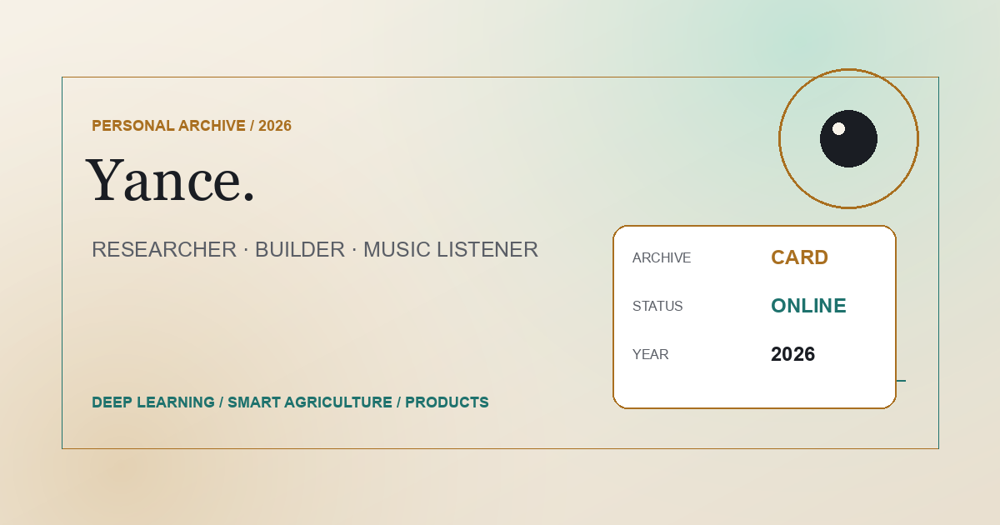

<p align="center">
  
</p>

<h1 align="center">Yance · Personal Archive</h1>

<p align="center">一个以档案叙事组织学术、研究、作品与现场记忆的多语言个人网站。</p>

<p align="center">
  <a href="https://www.yance777.com">www.yance777.com</a>
</p>

<p align="center">
  <a href="https://github.com/yance7/yance7.github.io/actions/workflows/ci.yml"></a>
  <a href="https://github.com/yance7/yance7.github.io/actions/workflows/quality.yml"></a>
  <a href="https://github.com/yance7/yance7.github.io/actions/workflows/pages.yml"></a>
</p>

<p align="center">
  
</p>

## 项目简介

网站以档案方式整理个人经历与创作，包含：

- Academics
- Honors
- Research
- Works
- Concerts
- 简体中文、繁体中文和英文
- 明暗主题
- 响应式布局
- 无障碍与减弱动效支持

## 技术栈

- Vue 3
- TypeScript
- Vite
- Vitest
- Playwright
- axe-core
- Lighthouse CI
- GitHub Actions
- GitHub Pages

## 项目结构

```text
src/
├── components/       可复用 Vue 组件
├── pages/             页面级组件
├── composables/       可复用组合式逻辑
├── data/              页面共享内容与类型
├── styles/            全局与页面样式
└── utils/             导航、媒体与预加载工具
html-src/              HTML 源文件
public/assets/         静态媒体与品牌资源
tests/                 单元、浏览器与视觉测试
.github/workflows/     GitHub Actions 工作流
```

- HTML 源文件位于 `html-src/`，根目录 HTML 文件由构建流程生成。
- 页面共享内容位于 `src/data/`。
- `dist/` 是生成产物，不提交到 Git。
- 视觉基线位于 `tests/e2e/visual-snapshots/`。

## 本地开发

环境要求：

- Node.js >= 22.12.0
- npm >= 10.9.0
- Python 工具依赖来自 `requirements-tools.txt`

安装依赖并启动开发环境：

```bash
npm ci
npm run dev
npm run check
npm run test:e2e
npm run preview
```

首次运行 Playwright 前安装浏览器：

```bash
npx playwright install --with-deps chromium webkit firefox
```

## 质量门禁

- `npm run check`：运行仓库检查、品牌资源检查、lint、类型检查、死代码检查、单元测试、构建和 smoke 检查。
- `npm run audit:repo`：检查跟踪文件、忽略规则和公开说明文本边界。
- `npm run audit:assets`：检查媒体格式、尺寸、可解码性和隐私相关元数据。
- `npm run links`：检查项目中的外部链接。
- GitHub Quality Audit：在 GitHub Actions 中运行 Lighthouse、浏览器、视觉、兼容性和无障碍质量检查。

当前 Lighthouse 预算如下，具体结果以每次审计为准：

| 指标 | 目标 |
| --- | --- |
| Desktop Performance | >= 90 |
| Mobile Performance | >= 85 |
| Accessibility | >= 98 |
| Best Practices | >= 95 |
| SEO | >= 95 |
| LCP | <= 2.5s |
| TBT | <= 300ms |
| CLS | <= 0.1 |
| INP | <= 200ms |

## 部署

- 通过 `.github/workflows/pages.yml` 部署。
- 发布目标为 GitHub Pages。
- 自定义域名为 `www.yance777.com`。
- `dist/` 不进入 Git。

## 资源、隐私与使用边界

- [ASSET_RIGHTS.md](ASSET_RIGHTS.md)
- [docs/album-cover-sources.md](docs/album-cover-sources.md)
- [docs/privacy-release-checklist.md](docs/privacy-release-checklist.md)
- [docs/security-privacy-decisions.md](docs/security-privacy-decisions.md)

仓库当前未提供通用开源许可证。仓库公开可见不等于授予复制、再分发或商业使用权限。第三方专辑封面、演唱会图像和其他媒体仍受原权利人权利约束。网站不接入第三方分析、广告或用户跟踪脚本。
